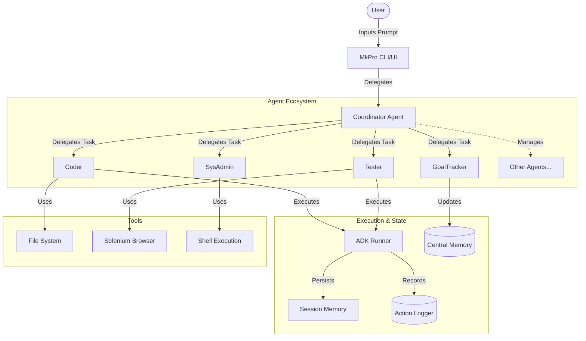

# mkpro - The AI Software Engineering Team

`mkpro` is an advanced, modular CLI assistant built on the Google Agent Development Kit (ADK). It orchestrates a team of **8 specialized AI agents** to autonomously handle complex software engineering tasks, from coding and testing to security audits and cloud deployment. It supports a multi-provider backend, allowing you to mix and match local models (Ollama) with powerful cloud models (Gemini, Bedrock).

## 🤖 Meet the Team

Your `mkpro` instance is not just a chatbot; it's a team of experts led by a Coordinator.

| Agent | Role & Capabilities |
| :--- | :--- |
| **Coordinator** | **Team Lead**. Orchestrates the workflow, manages long-term memory, and delegates tasks to the right specialist. It is your primary interface. |
| **GoalTracker** | **Project Manager**. Keeps track of ongoing session goals, creates TODO lists for complex tasks, and maintains progress in a local MapDB store. |
| **Coder** | **Software Engineer**. Reads, writes, and refactors code. Analyzes project structure and implements features. |
| **SysAdmin** | **System Operator**. Executes shell commands, manages files, and runs build tools (Maven, Gradle, npm). |
| **Tester** | **QA Engineer**. Writes unit and integration tests, runs test suites, and analyzes failure reports to suggest fixes. |
| **DocWriter** | **Technical Writer**. Maintains `README.md`, generates Javadocs/Docstrings, and ensures documentation stays in sync with code. |
| **SecurityAuditor** | **Security Analyst**. Scans code for vulnerabilities (SQLi, XSS, secrets), runs audit tools (`npm audit`), and recommends hardening steps. |
| **Architect** | **Principal Engineer**. Reviews high-level design, analyzes cohesion/coupling, enforces design patterns, and plans refactoring. |
| **DatabaseAdmin** | **DBA**. Writes complex SQL queries, creates schema migration scripts, and analyzes database structures. |
| **DevOps** | **SRE / Cloud Engineer**. Writes Dockerfiles, Kubernetes manifests, CI/CD configs, and interacts with cloud CLIs (AWS, GCP). |
| **DataAnalyst** | **Data Scientist**. Analyzes data sets (CSV, JSON), writes Python scripts (pandas, numpy) for statistical analysis, and generates insights. |
| **CodeEditor** | **Code Manipulator**. Safely applies code changes to files with a built-in diff preview and user confirmation step. |

## 🚀 Key Features

- **Goal Tracking**: Never lose track of original user requests during complex, multi-step sessions.
- **Granular Configuration**: Assign different models to different agents. Use a cheap, fast model (e.g., `gemini-1.5-flash`) for the *Coder* and a reasoning-heavy model (e.g., `claude-3-5-sonnet`) for the *Architect*.
- **Persistent Memory**:
    - **Central Store**: Project summaries and agent configurations are saved to `~/.mkpro/central_memory.db`.
    - **Local Session**: Context is managed efficiently with `/compact` to save tokens.
- **Multi-Provider**: seamless switching between **Ollama** (Local), **Gemini** (Google), and **Bedrock** (AWS).
- **Multi-Runner Support**: Choose between **InMemory**, **MapDB** (persistent), and **Postgres** (enterprise) execution environments for your agents.
- **Debug Awareness**: Agents are aware of which provider/model they are running on, helping in performance tuning and debugging.
- **Customizable Teams**: Define your own team rosters, agent descriptions, and specialized instructions using YAML files in `~/.mkpro/teams/`.

## 🛠️ Setup & Installation

### Prerequisites
- **Google Agent Development Kit (ADK)**: This project requires the **redbus version** of ADK. You must clone and install it locally from [redbus-labs/adk-java](https://github.com/redbus-labs/adk-java) before building `mkpro`.
- **Java 17+** and **Maven** (for building).
- **Ollama** (Optional): For local privacy-first inference.
- **Google API Key** (Optional): Set `GOOGLE_API_KEY` for Gemini.
- **AWS Credentials** (Optional): Set standard AWS env vars for Bedrock.

### Build
```bash
mvn clean package
```
This generates the native Windows executable `target/mkpro.exe` and a fat JAR.

### Run
```bash
./target/mkpro.exe
```

## 🏘️ Teams & Agent Workflows

`mkpro` now supports multiple agent team configurations. You can switch between different engineering squads depending on your task.

### How it Works:
1.  **Configuration Files**: Team definitions are stored in `~/.mkpro/teams/` as YAML files.
2.  **Default Team**: The `default.yaml` includes the full roster of 12 agents (Architect, Coder, DevOps, etc.).
3.  **Minimal Team**: Use `minimal.yaml` for lighter tasks requiring only the Coordinator and Coder.
4.  **Customization**: You can create your own YAML file (e.g., `audit_squad.yaml`) to define specialized agents for a specific project.

### Switching Teams:
Use the `/team` command in the console to list and select available team rosters. This will automatically rebuild the agent runner with the new instructions and roles.

## 🌍 Installation & System-Wide Setup

To use `mkpro` from any directory in your terminal, follow these steps:

### Windows
1.  Ensure you have built the project: `mvn package -DskipTests`.
2.  Add the project root directory to your System PATH environment variable.
    *   Search for "Edit the system environment variables".
    *   Click "Environment Variables".
    *   Under "System variables", find `Path`, select it, and click "Edit".
    *   Click "New" and paste the full path to your `mkpro` directory (e.g., `C:\DevTools\rblab\mkpro`).
    *   Click OK on all dialogs.
3.  Open a **new** command prompt and type `mkpro`.

### Linux / macOS
1.  Ensure you have built the project: `mvn package -DskipTests`.
2.  Make the script executable: `chmod +x mkpro.sh`.
3.  Create a symlink to `/usr/local/bin` (or add to your PATH in `.bashrc`/`.zshrc`):
    ```bash
    sudo ln -s $(pwd)/mkpro.sh /usr/local/bin/mkpro
    ```
4.  Open a new terminal and type `mkpro`.

## 🎮 Usage Guide

### Configuration
Use the interactive menu to set up your team:
```text
> /config
Select Agent to configure:
  [1] Architect (Current: OLLAMA - devstral-small-2)
  [2] Coder (Current: GEMINI - gemini-1.5-pro)
  ...
```

### Real-World Use Cases

#### 1. Full Feature Implementation
> **User**: "Implement a new user login endpoint with JWT authentication."
>
> **Coordinator**:
> 1.  Asks **GoalTracker** to create a progress tracker and break down the tasks.
> 2.  Asks **Architect** to design the API interface and security capability.
> 3.  Asks **Coder** to write the Controller, Service, and JWT utility classes.
> 4.  Asks **Tester** to generate JUnit tests for the new endpoint.
> 5.  Asks **GoalTracker** to update progress after each success.

#### 2. Security Hardening
> **User**: "Audit the project for security vulnerabilities."
>
> **Coordinator**:
> 1.  Delegates to **SecurityAuditor** to scan `pom.xml`/`package.json` and source code.
> 2.  **SecurityAuditor** identifies a hardcoded secret or vulnerable lib.
> 3.  **Coordinator** asks **Coder** to apply the fix.
> 4.  **Coordinator** asks **Tester** to verify nothing broke.

#### 3. Cloud Migration
> **User**: "Containerize this application for deployment to AWS."
>
> **Coordinator**:
> 1.  Delegates to **DevOps** to write a `Dockerfile` and `docker-compose.yml`.
> 2.  **DevOps** creates AWS ECS task definitions.
> 3.  **SysAdmin** builds the docker image locally to verify it builds.

## ⌨️ Command Reference

| Command | Description |
| :--- | :--- |
| `/help` | Show this list. |
| `/status` | **Dashboard**. View agent models, providers, and memory stats. |
| `/stats` | **Performance**. Show agent usage statistics (latencies, token length, models). |
| `/runner` | **Switch Runner**. Choose between InMemory, MapDB, or Postgres. |
| `/team` | **Switch Team**. Select a different agent roster from `~/.mkpro/teams/`. |
| `/config` | **Configure Team**. Interactive menu to set agent models/providers. Settings are saved. |
| `/init` | **Learn Project**. Agents scan and memorize the project structure. |
| `/re-init` | **Refresh Memory**. Re-scan the project if structure changed significantly. |
| `/summarize` | Generate and save a session summary to `session_summary.txt`. |
| `/provider` | Quick switch for the **Coordinator's** provider. |
| `/model` | Quick switch for the **Coordinator's** model. |
| `/compact` | **Save Tokens**. Summarize history and start fresh. |
| `/reset` | Clear session memory. |
| `exit` | Quit. |

## 🏗️ Architecture

The project is modularized for maintainability:
- `com.mkpro.MkPro`: Main entry point and CLI loop.
- `com.mkpro.agents.AgentManager`: Logic for creating and delegating to sub-agents.
- `com.mkpro.tools.MkProTools`: Factory for all tool implementations (File I/O, Shell, Web).
- `com.mkpro.models`: Data classes for configuration and persistence.

### 🧠 How Agents Share Memory

`mkpro` uses a **hub-and-spoke** memory architecture to ensure agents remain focused while still being able to collaborate:

1.  **Coordinator as the Hub**: Sub-agents (like Coder or SysAdmin) are technically "amnesic" for security and focus. They operate in isolated, short-lived sessions. The **Coordinator** is responsible for providing all necessary context (from previous turns or other agents) in the instructions it sends when delegating a task.
2.  **Central Memory (Shared Whiteboard)**: A persistent MapDB store (`central_memory.db`) acts as a long-term project memory. It stores project-wide summaries, agent configurations, and session-agnostic goals. The **GoalTracker** agent primarily manages this space.
3.  **Action Logs (Audit Trail)**: Every user interaction and agent action is recorded in `mkpro_logs.db`. The **Coordinator** has a specialized tool (`get_action_logs`) to read these logs, allowing it to "recall" past events and decisions to inform current tasks.
4.  **Runner Persistence**: When using `MAP_DB` or `POSTGRES` runners, the individual conversation history for each agent is persisted, allowing them to maintain context across a long-running session without hitting token limits (especially when combined with `/compact`).

### Agent Interaction Flow

