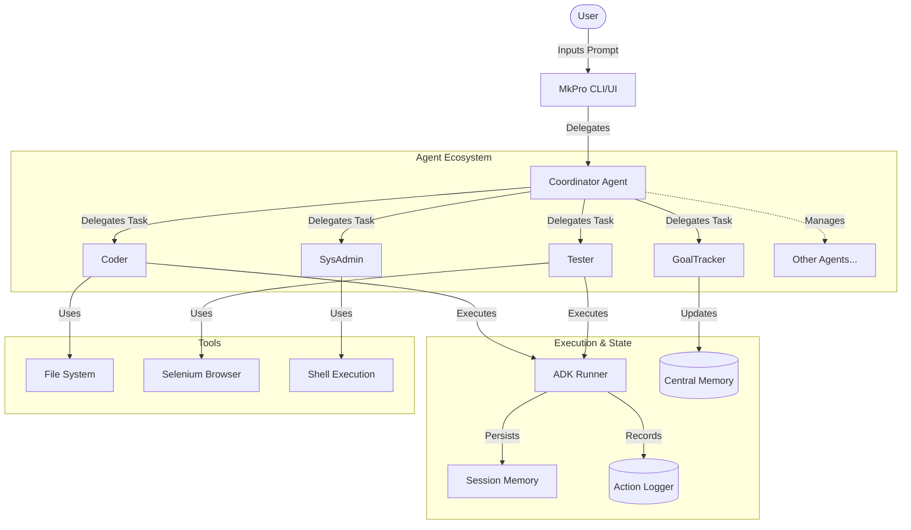

# mkpro - The AI Software Engineering Team

`mkpro` is an advanced, modular CLI assistant built on the Google Agent Development Kit (ADK). It orchestrates a team of **13 specialized AI agents** to autonomously handle complex software engineering tasks, from coding and testing to security audits and cloud deployment. It supports a multi-provider backend, allowing you to mix and match local models (Ollama) with powerful cloud models (Gemini, Bedrock).

## 🤖 Meet the Team

Your `mkpro` instance is not just a chatbot; it's a team of experts led by a Coordinator.

| Agent | Role & Capabilities |
| :--- | :--- |
| **Coordinator** | **Team Lead**. Orchestrates the workflow, manages long-term memory, and delegates tasks to the right specialist. It is your primary interface. |
| **GoalTracker** | **Project Manager**. Keeps track of ongoing session goals, creates TODO lists for complex tasks, and maintains progress in a local MapDB store. |
| **Coder** | **Software Engineer**. Reads, writes, and refactors code. Analyzes project structure, implements features, and leverages **Graph Memory** to recall architectural patterns and context. |
| **SysAdmin** | **System Operator**. Executes shell commands, manages infrastructure, and runs build tools (Maven, Gradle, npm). *Note: Focuses strictly on infrastructure and shell commands. Restricted from modifying code directly or managing git.* |
| **Tester** | **QA Engineer**. Writes unit and integration tests, runs test suites, and analyzes failure reports to suggest fixes. |
| **DocWriter** | **Technical Writer**. Maintains `README.md`, generates Javadocs/Docstrings, and ensures documentation stays in sync with code. |
| **SecurityAuditor** | **Security Analyst**. Scans code for vulnerabilities (SQLi, XSS, secrets), runs audit tools (`npm audit`), and recommends hardening steps. |
| **Architect** | **Principal Engineer**. Reviews high-level design, analyzes cohesion/coupling, enforces design patterns, plans refactoring, and uses **Graph Memory** to store and retrieve system designs. |
| **DatabaseAdmin** | **DBA**. Writes complex SQL queries, creates schema migration scripts, and analyzes database structures. |
| **DevOps** | **SRE / Cloud Engineer**. Writes Dockerfiles, Kubernetes manifests, CI/CD configs, and interacts with cloud CLIs (AWS, GCP). |
| **DataAnalyst** | **Data Scientist**. Analyzes data sets (CSV, JSON), writes Python scripts (pandas, numpy) for statistical analysis, and generates insights. |
| **CodeEditor** | **Code Manipulator**. Safely applies code changes to files with a built-in diff preview and user confirmation step. Automatically creates backups using `Maker.backItUp`. |
| **GitAgent** | **Version Control Specialist**. Dedicated version control specialist responsible for staging, committing, and pushing code. It automatically enforces semantic commit messages and appends the AI session's token consumption statistics to the commit history. (Note: The GitAgent automatically appends session token usage to all commit messages to ensure AI resource transparency.) |

### Agent Interaction Flow


```mermaid
graph TD
    User([User]) -->|Inputs Prompt| MkPro[MkPro CLI/UI]
    MkPro -->|Delegates| Coordinator[Coordinator Agent]
    
    subgraph "Agent Ecosystem"
        Coordinator -->|Delegates Task| Coder[Coder]
        Coordinator -->|Delegates Task| Tester[Tester]
        Coordinator -->|Delegates Task| SysAdmin[SysAdmin]
        Coordinator -->|Delegates Task| GoalTracker[GoalTracker]
        Coordinator -.->|Manages| Others[Other Agents...]
    end

    subgraph "Execution & State"
        Coder -->|Executes| Runner[ADK Runner]
        Tester -->|Executes| Runner
        Runner -->|Persists| Session[Session Memory]
        Runner -->|Records| ActionLogger[(Action Logger)]
        GoalTracker -->|Updates| CentralMem[(Central Memory)]
    end

    subgraph "Tools"
        Coder -->|Uses| FileTools[File System]
        Tester -->|Uses| Selenium[Selenium Browser]
        SysAdmin -->|Uses| Shell[Shell Execution]
    end
```

## 🏗️ Architecture: The Goal-Driven Core

`mkpro` is built around a rigorous goal-tracking architecture that ensures agents remain focused on the user's ultimate objective, even during long-running sessions.

### The Maker Class
The `Maker` class provides the **"heartbeat"** of this goal-driven execution. It acts as the central orchestrator that evaluates the current state of the project against the defined goal tree.

### Goal Stimulus System (`getGoalStimulus`)
To drive the agents forward, the `Maker` generates a dynamic **Goal Stimulus**. This is a context-aware report provided to the agents in every turn, derived from the `getGoalStimulus` method:

*   **Prioritized Action**: It analyzes the entire goal tree and prioritizes items based on their status: **FAILED** > **IN_PROGRESS** > **PENDING**. This ensures agents immediately address errors before continuing with the plan.
*   **Effective Leaf Goals**: It identifies "Effective Leaf" goals—these are actionable tasks that either have no sub-goals or whose sub-goals are all completed. By presenting only these leaves, the system ensures agents focus on granular, actionable tasks rather than being overwhelmed by high-level milestones.
*   **Context Optimization**: To preserve token space, it intelligently summarizes the goal tree, showing active priorities while keeping the "Pending" list concise.

## 🛡️ Safety Features

To ensure project integrity and prevent accidental data loss, `mkpro` includes built-in safety mechanisms:
- **Automatic Backups**: The `CodeEditor` agent automatically creates backups of files before performing any modifications (utilizing the `Maker.backItUp` utility).
- **Enforced Role Delegation**: The `SysAdmin` agent is strictly restricted from modifying source code directly. It must delegate all code changes to the `CodeEditor`, ensuring every change is subject to the safety pipeline and diff previews.

## 🚀 Key Features

- **Graph Memory & Visualization**: Agents can now store structured associative memories in a MapDB-backed graph, viewable via the `/visualize` command.
- **Mesh Networking**: Multiple instances of mkpro can discover each other via mDNS and synchronize their memory and graph states in real-time.
- **Token Tracking & Analytics**: Comprehensive token tracking per session, agent, and model, viewable via the `/stats` command.
- **Goal Tracking**: Never lose track of original user requests during complex, multi-step sessions.
- **Granular Configuration**: Assign different models to different agents. Use a cheap, fast model (e.g., `gemini-1.5-flash`) for the *Coder* and a reasoning-heavy model (e.g., `claude-3-5-sonnet`) for the *Architect*.
- **Per-Team Configurations**: Save different model setups for different teams (e.g., a "Security" team using specialized models vs. a "Dev" team using fast models).
- **Clipboard Integration**: Paste text or images directly into the terminal using `Ctrl+V`. Images are automatically saved and provided to agents.
- **Persistent Memory**:
    - **Central Store**: Project summaries and agent configurations are saved to `~/.mkpro/central_memory.db`.
    - **Local Session**: Context is managed efficiently with `/compact` to save tokens.
- **Multi-Provider**: seamless switching between **Ollama** (Local), **Gemini** (Google), **Bedrock** (AWS), **Azure** (OpenAI), and **Sarvam**.
- **Multi-Runner Support**: Choose between **InMemory**, **MapDB** (persistent), and **Postgres** (enterprise) execution environments for your agents.
- **Debug Awareness**: Agents are aware of which provider/model they are running on, helping in performance tuning and debugging.
- **Customizable Teams**: Define your own team rosters, agent descriptions, and specialized instructions using YAML files in `~/.mkpro/teams/`.

## ⌨️ Command Enhancements

Manage your AI team with precision using enhanced CLI commands:

- **`/config`**: View and modify agent configurations dynamically.
    - `/config list`: Displays the current model and provider assigned to every agent in the team.
    - `/config [agent] [model]`: Instantly reassign a specific agent to a different model.
- **`/team`**: Swap entire team structures on the fly. 
    - Quickly switch between specialized squads (e.g., from a `General` coding team to a specialized `Security` or `DevOps` team) to suit the current task phase.

## ⚙️ Dynamic Model Registry & Sync

`mkpro` features a sophisticated model management system that ensures your environment is always up-to-date with the latest AI advancements.

- **Dynamic Loading**: Model lists for **Gemini**, **Bedrock**, and **Azure** are dynamically loaded from a `models.yaml` file. The system prioritizes a local version in `Documents/mkpro/models.yaml`, falling back to a bundled resource if the local file is missing.
- **Weekly Git Syncing**: To keep pace with rapid model releases, `mkpro` automatically synchronizes its model registry once a week. This process runs in the background, pulling the latest definitions from a remote raw Git repository.
- **Customizable Remote**: The sync source is fully customizable. Users can specify their own manifest URL by setting the `models.remote.url` property in the `config.properties` file (defaulting to the official GitHub Raw URL).
- **Real-time Ollama Detection**: Unlike cloud providers, **Ollama** models are excluded from the static registry. Instead, they are fetched dynamically from the active local Ollama server, reflecting your current local library in real-time.

To use the new background capabilities, you simply need to tell me what you want to run and specify that it should run in the "background" or "detached."

Here is how you can use it:

### 1. Start a Service
Just ask me to run a command in the background.
*   **Example:** "Start the Spring Boot application in the background."
*   **Example:** "Run `python server.py` as a background process."

### 2. Check What's Running
Ask for a status update.
*   **Example:** "List running background jobs."
*   **Example:** "Show me the logs for the running server."

### 3. Stop a Service
Ask me to kill a specific job or all of them.
*   **Example:** "Stop the background job with ID 1."
*   **Example:** "Kill the ping process."

**Try it out:**
Do you have a specific server or script in this project you want to start up now? (e.g., `mvn spring-boot:run`)

## 💎 Supported Gemini Models

`mkpro` is optimized for the latest Gemini 3, 2.0 and 1.5 series models. You can configure any agent to use these models via the `/config` command or team YAML files:

| Model | Best For |
| :--- | :--- |
| **gemini-3.1-pro-preview** | **Next-gen Pro Preview**. Preview of the most capable Gemini model. |
| **gemini-3.1-flash-lite** | **Ultra-efficient Flash**. Smallest and fastest model for high-frequency tasks. |
| **gemini-3-flash-preview** | **Gemini 3 Flash Preview**. Early access to the next-gen flash model. |
| **gemini-3-pro** | **Gemini 3 (Future/Flagship)**. Speculative next-generation flagship model. |
| **gemini-3-flash** | **Gemini 3 Flash (Future/Speed)**. Speculative next-generation speed-optimized model. |
| **gemini-2.0-flash** | **Next-gen Speed & Multimodal**. High performance and low latency. |
| **gemini-2.0-flash-thinking-exp**| **Advanced Reasoning**. Experimental model with deep reasoning capabilities. |
| **gemini-2.0-pro-exp** | **Ultimate Intelligence**. The most capable model for complex reasoning and architecture. |
| **gemini-1.5-pro** | **Large Context Reasoning**. Stable option for processing massive codebases (up to 2M tokens). |
| **gemini-1.5-flash** | **Efficiency**. Cost-effective and reliable for high-frequency sub-agent tasks. |
| **gemini-1.5-flash-8b** | **High-speed, small-scale**. Optimized for high-volume, lower-complexity tasks. |

*Full supported list: gemini-3.1-pro-preview, gemini-3.1-flash-lite, gemini-3-flash-preview, gemini-3-pro, gemini-3-flash, gemini-2.0-flash, gemini-2.0-flash-lite-preview-02-05, gemini-2.0-pro-exp-02-05, gemini-2.0-flash-thinking-exp-01-21, gemini-1.5-pro, gemini-1.5-pro-latest, gemini-1.5-pro-002, gemini-1.5-flash, gemini-1.5-flash-latest, gemini-1.5-flash-002, gemini-1.5-flash-8b, gemini-1.5-flash-8b-latest, gemini-1.5-flash-8b-001.*

## 🦙 Supported Ollama Models

For local, privacy-first inference, `mkpro` supports a wide range of models via **Ollama**. These are ideal for running on your own hardware (e.g., Apple Silicon, NVIDIA GPUs) without sending data to the cloud.

| Model | Best For | Recommended Variant |
| :--- | :--- | :--- |
| **DeepSeek-Coder-V2** | **Coding & Architecture**. State-of-the-art open model for code generation and understanding. | `deepseek-coder-v2` |
| **Qwen 2.5 Coder** | **Code Repair & Polyglot**. Excellent at fixing bugs and supporting 92+ languages. | `qwen2.5-coder:32b` |
| **Llama 3.3** | **General Reasoning**. Powerful all-rounder from Meta with strong logic capabilities. | `llama3.3` |
| **Phi-4** | **Complex Reasoning**. Microsoft's small but mighty model, optimized for deep logical tasks. | `phi4` |
| **Llama 3.1** | **General Purpose**. High-quality model from Meta for a variety of tasks. | `llama3.1` |
| **Codestral** | **FSE (Full-Stack Engineering)**. Mistral's model optimized for code generation and tasks. | `codestral` |
| **Command R** | **Retrieval & Long Context**. Optimized for RAG and long-context understanding. | `command-r` |

## 🚀 Getting Started

### Prerequisites

- **Java 17+**
- **Maven**
- **Google Cloud API Key** (for Gemini) or **AWS Credentials** (for Bedrock) or **Ollama** installed (for local models).

### Installation

1. Clone the repository:
   ```bash
   git clone https://github.com/mk-sharma/mkpro.git
   cd mkpro
   ```
2. Build the project:
   ```bash
   mvn clean install
   ```

### Configuration

Set your environment variables:
```bash
# For Gemini
export GOOGLE_API_KEY=your_google_api_key

# For AWS Bedrock
export AWS_ACCESS_KEY_ID=your_access_key
export AWS_SECRET_ACCESS_KEY=your_secret_key
export AWS_REGION=your_region
```

### Running mkpro

Launch the CLI:
```bash
java -jar target/mkpro-1.0-SNAPSHOT.jar
```

Once inside, you can use the `/config` command to set your default provider and model.

## 🤝 Contributing

We welcome contributions! Please feel free to submit Pull Requests or open issues for feature requests and bug reports.

## 📜 License

This project is licensed under the Apache License 2.0.
