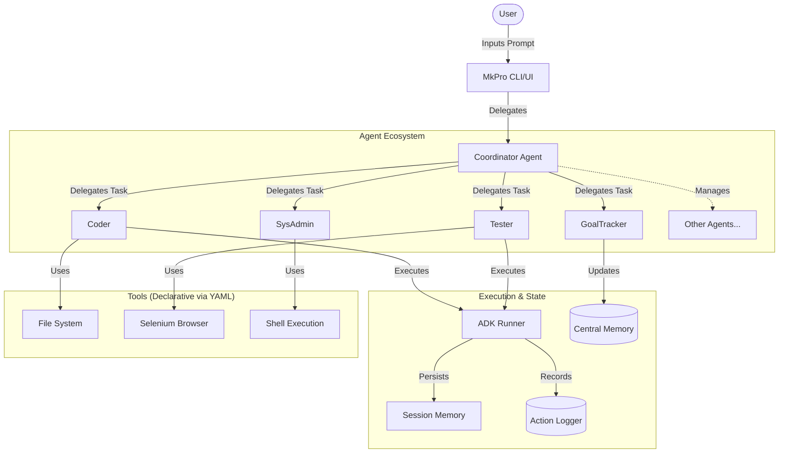

# mkpro - The AI Software Engineering Team

`mkpro` is an advanced, modular CLI assistant built on the Google Agent Development Kit (ADK). It orchestrates a team of **15 specialized AI agents** to autonomously handle complex software engineering tasks, from coding and testing to security audits and cloud deployment. It supports a multi-provider backend, allowing you to mix and match local models (Ollama) with powerful cloud models (Gemini, Bedrock, Azure).

## 🤖 Meet the Team

Your `mkpro` instance is not just a chatbot; it's a team of experts led by a Coordinator.

| Agent | Role & Capabilities |
| :--- | :--- |
| **Coordinator** | **Team Lead**. Orchestrates the workflow, manages long-term memory, and delegates tasks to the right specialist. It is your primary interface. |
| **GoalTracker** | **Project Manager**. Keeps track of ongoing session goals, creates TODO lists for complex tasks, and maintains progress in a local MapDB store. |
| **Coder** | **Software Engineer**. Reads and analyzes code. Leverages **Graph Memory** and **codebase search** to recall architectural patterns and context. |
| **CodeEditor** | **Code Manipulator**. Safely applies code changes to files with a built-in diff preview and user confirmation step. Automatically creates backups using `Maker.backItUp`. |
| **SysAdmin** | **System Operator**. Executes shell commands, manages infrastructure, and runs build tools (Maven, Gradle, npm). *Restricted from modifying code directly or managing git.* |
| **GitAgent** | **Version Control Specialist**. Stages, commits, and pushes code. Enforces semantic commit messages and appends AI session token statistics to commit history. |
| **Tester** | **QA Engineer**. Writes unit and integration tests, runs test suites, performs browser-based E2E testing via Selenium. |
| **DocWriter** | **Technical Writer**. Maintains `README.md`, generates Javadocs/Docstrings, and ensures documentation stays in sync with code. |
| **SecurityAuditor** | **Security Analyst**. Scans code for vulnerabilities (SQLi, XSS, secrets), runs audit tools (`npm audit`), and recommends hardening steps. |
| **Architect** | **Principal Engineer**. Reviews high-level design, analyzes cohesion/coupling, enforces design patterns, plans refactoring, and uses **Graph Memory** to store and retrieve system designs. |
| **DatabaseAdmin** | **DBA**. Writes complex SQL queries, creates schema migration scripts, and analyzes database structures. |
| **DevOps** | **SRE / Cloud Engineer**. Writes Dockerfiles, Kubernetes manifests, CI/CD configs, and interacts with cloud CLIs (AWS, GCP). |
| **DataAnalyst** | **Data Scientist**. Analyzes data sets (CSV, JSON), writes Python scripts (pandas, numpy) for statistical analysis, and generates insights. |
| **AndroidDev** | **Mobile Engineer (Android)**. Expert in Kotlin, Jetpack Compose, Android SDK, and Gradle-based Android projects. |
| **IosDev** | **Mobile Engineer (iOS)**. Expert in Swift, SwiftUI, Xcode, and iOS frameworks. |

### Agent Interaction Flow


```mermaid
graph TD
    User([User]) -->|Inputs Prompt| MkPro[MkPro CLI/UI]
    MkPro -->|Delegates| Coordinator[Coordinator Agent]
    
    subgraph "Agent Ecosystem"
        Coordinator -->|Delegates Task| Coder[Coder]
        Coordinator -->|Delegates Task| Tester[Tester]
        Coordinator -->|Delegates Task| SysAdmin[SysAdmin]
        Coordinator -->|Delegates Task| GoalTracker[GoalTracker]
        Coordinator -.->|Manages| Others[Other Agents...]
    end

    subgraph "Execution & State"
        Coder -->|Executes| Runner[ADK Runner]
        Tester -->|Executes| Runner
        Runner -->|Persists| Session[Session Memory]
        Runner -->|Records| ActionLogger[(Action Logger)]
        GoalTracker -->|Updates| CentralMem[(Central Memory)]
    end

    subgraph "Tools (Declarative via YAML)"
        Coder -->|Uses| FileTools[File System]
        Tester -->|Uses| Selenium[Selenium Browser]
        SysAdmin -->|Uses| Shell[Shell Execution]
    end
```

## 🏗️ Architecture

### Core Components

| Component | Responsibility |
| :--- | :--- |
| `BootstrapService` | Application initialization, service wiring, shutdown hooks |
| `AgentManager` | Creates LLM instances, builds runners, manages delegation tools |
| `ToolRegistry` | Maps declarative tool names (from YAML) to `BaseTool` instances |
| `AgentFactory` | Builds `LlmAgent` from `AgentDefinition` + resolved tools |
| `CentralMemory` | Persistent state store (hot/shared split architecture) |
| `MkProContext` | Application state container passed to commands and UI |
| `TerminalUI` | JLine-based interactive terminal loop |

### CentralMemory Architecture

CentralMemory uses a **hot/shared split** for multi-instance safety:

- **Hot Store** (per-instance, always open): Agent statistics — high-frequency writes with zero contention between instances.
- **Shared Store** (brief file lock with retry): Agent configs, goals, memories, MCP servers — opened briefly for writes, reads served from in-memory cache.
- **Local Cache**: `ConcurrentHashMap` for configs, volatile lists for servers. Populated on startup, invalidated on writes, refreshable via `refreshCache()` when SyncEngine receives peer updates.

### Declarative Tool Assignment

Agent tools are defined in team YAML files rather than hardcoded:

```yaml
agents:
  - name: Coder
    tools: [file_read, clipboard, codebase_search, mcp_scan, graph_memory, fetch_url]
    
  - name: SysAdmin
    tools: [shell, file_read, file_write, safe_write, clipboard]
    
  - name: Tester
    tools: [file_read, file_write, safe_write, clipboard, shell, selenium]
```

Available tool names: `file_read`, `file_write`, `safe_write`, `clipboard`, `shell`, `image`, `codebase_search`, `multi_project_search`, `mcp_scan`, `graph_memory`, `fetch_url`, `stats`, `selenium`, `scripting`.

YAMLs without a `tools` field fall back to name-based assignment for backward compatibility.

### Goal Stimulus System

The `Maker.getGoalStimulus()` method generates a dynamic **Goal Stimulus** report for agents each turn:

- **Prioritized Action**: FAILED > IN_PROGRESS > PENDING — agents fix errors before continuing.
- **Effective Leaf Goals**: Only actionable tasks (no sub-goals, or all sub-goals completed) are shown.
- **Context Optimization**: Pending list capped at 5 items to preserve token space.

### Markov Chain Router

A learned probabilistic model that fast-routes requests to agents **without LLM calls**:

- **IntentClassifier**: Categorizes user input via keyword/regex matching (14 categories)
- **MarkovRouter**: Transition matrix predicts P(agent | category) with confidence scoring
- **Zero-latency routing**: When confidence ≥ 65%, bypasses the Coordinator LLM entirely
- **Self-improving**: Trains from JSONL data on startup, learns from live usage, auto-exports on exit
- **Transparent**: Always shows routing decision and confidence percentage

Training pipeline:
```
Session usage → auto-export JSONL on exit → /train on next startup → better routing
```

### Maker Loop (Goal-Driven Supervisor)

The Maker is a persistent loop supervisor that ensures tasks are **completed, not just attempted**:

- **Goal tracking**: Every user request becomes a tracked goal with turn counting
- **Per-turn stimulus**: Injects progress context into the Coordinator ("Turn 3/5, predicted next: Tester")
- **Completion verification**: Markov model predicts P(COMPLETE | tool_sequence) from learned patterns
- **Failure recovery**: Automatically retries failed steps (up to 3 attempts)
- **Stall detection**: Escalates to user when turns exceed 2x average for the category
- **Transparent reasoning**: Shows thought process for every decision (CONTINUE/RETRY/ESCALATE/COMPLETE)
- **Self-improving**: Learns from every completed/failed goal sequence

Decision flow:
```
Turn complete → predict completion → if P≥75%: COMPLETE
                                   → if failed: RETRY (max 3)
                                   → if stalled: ESCALATE to user
                                   → else: CONTINUE (inject stimulus)
```

## 🛡️ Safety & Security

### Defense-in-Depth

| Layer | Class | Approach |
| :--- | :--- | :--- |
| **Command Execution** | `CommandPolicy` | Allowlist-based — only explicitly permitted commands (git, mvn, npm, docker, etc.) can execute. Dangerous patterns (force push to main, recursive delete, reverse shells) are blocked even on allowed commands. |
| **File Access** | `PathValidator` | Restricts all file operations to the project root + temp directory. Blocks path traversal (`../../`), symlink escapes, and sensitive files (.env, id_rsa, .pem, credentials.json, .aws/, .ssh/). |
| **Shell Execution** | `ShellExecutor` | Enforces timeouts (120s default), output size limits (100KB), stderr capture, and working directory control. Kills processes that exceed limits. |
| **Message Authentication** | `MessageAuthenticator` | HMAC-SHA256 signing for all P2P mesh messages. Unsigned messages rejected when auth is enabled. |
| **mTLS Mesh Security** | `CertTools` | Mandatory mutual TLS for all peer-to-peer communication. Zero-downtime rotation using the **Dual-Trust** lifecycle. |

### Additional Safety Mechanisms

- **Automatic Backups**: `CodeEditor` creates backups before modifications (`Maker.backItUp`).
- **Enforced Role Delegation**: `SysAdmin` cannot modify code directly — must delegate to `CodeEditor`.
- **Configurable Policy**: Users can customize the command allowlist via `~/.mkpro/command_policy.yaml`.
- **Manual Emergency Revocation**: Operators can immediately block compromised nodes by removing them from `~/.mkpro/p2p_whitelist.txt`.

### mTLS & Mesh Operations

For detailed mTLS procedures, refer to:
- **[mTLS Policy & Recovery](MTLS_POLICY.md)**: Standards, Emergency Revocation, and Recovery guides.
- **[Rotation Checklist](MTLS_ROTATION_CHECKLIST.md)**: Step-by-step guide for zero-downtime certificate rotation.

**The Dual-Trust Lifecycle:**
1.  **Phase A (Expansion)**: Nodes trust both the Old and New Root CAs.
2.  **Phase B (Rotation)**: Node identity certificates are swapped to the New CA.
3.  **Phase C (Contraction)**: Old Root CA is removed; only the New CA is trusted.

## 🚀 Key Features

- **Web UI**: Optional browser-based chat interface (`--web` flag). Markdown rendering, syntax highlighting, real-time streaming via WebSocket. Commands work from web too. Includes MapDB browser (`/db`) and Knowledge dashboard (`/knowledge`).
- **Groovy Script Engine**: Sandboxed Groovy execution for data processing. Agents use `execute_script`, `create_script`, `list_scripts` tools. Scripts persist in CentralMemory, blocked from Runtime/ProcessBuilder/Thread/networking. 30s timeout.
- **Graph Memory & Visualization**: Agents store structured associative memories in a MapDB-backed graph, viewable via `/visualize`.
- **Mesh Networking**: Multiple mkpro instances discover each other via mDNS and synchronize memory/graph states in real-time. Automatic reconnection with exponential backoff.
- **Cross-Instance Agent Communication**: Agents can directly ask agents on peer instances for help. Architect on Instance A can query Architect on Instance B about its project. Peer handshake exchanges project info on connection.
- **Self-Adaptive Model Resilience**: YAML-defined fallback models per agent. Health-based routing on connection failures. Non-blocking recommendations when fallback succeeds.
- **Learned Intent Patterns**: IntentClassifier adapts to your vocabulary. TF-IDF extraction of distinctive unigrams + bigrams from training data. System gets smarter each session.
- **Stall Prediction & Redirect**: Maker detects stall patterns from history. On stall, routes to alternative agent (load balancer with memory) rather than giving up. Max 2 redirects before wrap-up.
- **Heuristic Completion Detection**: Maker reads response text for completion signals ("verified", "successfully", "complete") alongside model-based prediction.
- **Session History**: Session persists across restarts (MapDB runner). `/history` shows past exchanges. Session summary shown on startup.
- **Knowledge Scheduler**: Autonomous topic-based knowledge accumulator (`--scheduler` flag). Fetches configured sources on a schedule, analyzes with LLM agents, builds evolving topic reports. Reports searchable via TF-IDF bag-of-words embeddings (`/know <query>`). Gets smarter each cycle.
- **Token Tracking & Analytics**: Comprehensive token tracking per session, agent, and model, viewable via `/stats`.
- **Goal Tracking**: Never lose track of original user requests during complex, multi-step sessions.
- **Granular Configuration**: Assign different models to different agents via `/config`.
- **Per-Team Configurations**: Save different model setups for different teams using YAML files.
- **Multi-Ollama Endpoints**: Route different agents to different Ollama servers. Heavy models on GPU boxes, light models locally.
- **Multimodal Support**: Agents can analyze images (vision) and transcribe/summarize audio files natively via Gemini.
- **Autonomous Memory**: Agents can commit insights to CentralMemory (`commit_to_memory`) and recall them later — persists across sessions.
- **Session State Injection**: Coordinator starts each session aware of pending goals, project memory, and MCP context from prior sessions.
- **Training Data Export**: `/export` extracts all 15 agents' sessions as JSONL for fine-tuning your own SLM.
- **Clipboard Integration**: Paste text or images directly into the terminal using `Ctrl+V`.
- **Persistent Memory**:
    - **Shared Store**: Configs and goals saved to `~/Documents/mkpro/central_memory.db`.
    - **Local Store**: Per-instance stats in `.mkpro/` project directory.
- **Multi-Provider**: Seamless switching between **Ollama** (Local), **Gemini** (Google), **Bedrock** (AWS), **Azure** (OpenAI), and **Sarvam**.
- **Multi-Runner Support**: Choose between **InMemory**, **MapDB** (persistent), and **Postgres** (enterprise) execution environments.
- **Background Jobs**: Start, monitor, and stop background processes directly from the chat.
- **MCP Server Integration**: Connect to MCP servers for Figma design-to-code, browser automation, and more.
- **Project Auto-Detection**: Automatically detects Android, iOS, React, Flutter, Vue, Angular, Java/Maven, and Java/Gradle projects for intelligent file placement.

## ⌨️ Commands

| Command | Description |
| :--- | :--- |
| `/config` | View and modify agent model/provider assignments |
| `/config list` | Show all agent configurations |
| `/config [agent] [model]` | Reassign an agent to a different model |
| `/ollama` | Manage multiple Ollama server endpoints |
| `/ollama add <name> <url>` | Add a new Ollama endpoint |
| `/ollama list` | Show all active Ollama endpoints |
| `/ollama models [name]` | Fetch models from a specific server |
| `/ollama status` | Check connectivity of all servers |
| `/team` | Swap entire team structures |
| `/stats` | View token usage statistics |
| `/visualize` | Visualize the graph memory |
| `/mcp` | Manage MCP server connections |
| `/index` | Index project files for semantic search |
| `/model` | Switch models |
| `/runner` | Switch execution runner type |
| `/network` | Manage mesh networking peers |
| `/network connect <ip:port>` | Manually connect to a peer instance |
| `/network peers` | List discovered peers with project info |
| `/cert` | Show mTLS certificate details and rotation status |
| `/config fallback <agent> <model@provider>` | Set fallback model for an agent |
| `/config fallback default <model@provider>` | Set global fallback for all agents |
| `/remember` | Save a project summary to persistent memory |
| `/export` | Export chat sessions as JSONL training data |
| `/train` | Train Markov Router from JSONL data |
| `/train status` | Show router model stats, transition matrix, and learned patterns |
| `/train reset` | Clear model and retrain from scratch |
| `/train threshold <N>` | Set Markov confidence threshold (10-99%) |
| `/history` | Show last 10 chat exchanges from session |
| `/history N` | Show last N exchanges |
| `/history new` | Start a fresh session |
| `/know <query>` | Search accumulated knowledge by TF-IDF similarity |
| `/know topics` | List all knowledge topics with summaries |
| `/know topic <name>` | Show full report for a specific topic |
| `/know status` | Show knowledge scheduler status |
| `/know refresh <name>` | Force refresh a topic (or 'all') |
| `/know approve <name>` | Promote a discovered sub-topic to scheduled |
| `/know dismiss <name>` | Discard a pending discovery |
| `/status` | Show system status, endpoints, and agent assignments |
| `/help` | Show available commands |
| `/exit`, `/quit` | Exit the application |

## ⚙️ Dynamic Model Registry & Sync

- **Dynamic Loading**: Model lists for **Gemini**, **Bedrock**, and **Azure** are loaded from `models.yaml`. Local version in `Documents/mkpro/models.yaml` takes priority over bundled defaults.
- **Weekly Git Syncing**: Background sync pulls latest model definitions from a remote Git repository.
- **Customizable Remote**: Set `models.remote.url` in `config.properties` to use your own manifest.
- **Real-time Ollama Detection**: Ollama models are fetched dynamically from your local server's `/api/tags` endpoint — always reflects your current local library.
- **Multi-Endpoint Aggregation**: Models are fetched from ALL registered Ollama endpoints. Models from remote servers appear prefixed (e.g., `gpu-box/codestral`).
- **Per-Agent Routing**: Assign specific agents to specific Ollama servers using `model@server-name` syntax in `/config`.

## 💎 Supported Gemini Models

| Model | Best For |
| :--- | :--- |
| **gemini-3.1-pro-preview** | Next-gen Pro Preview — most capable Gemini model |
| **gemini-3.1-flash-lite** | Ultra-efficient — smallest and fastest |
| **gemini-3-flash-preview** | Gemini 3 Flash Preview |
| **gemini-2.0-flash** | Next-gen Speed & Multimodal |
| **gemini-2.0-flash-thinking-exp** | Advanced Reasoning (experimental) |
| **gemini-2.0-pro-exp** | Ultimate Intelligence — complex reasoning and architecture |
| **gemini-1.5-pro** | Large Context Reasoning (up to 2M tokens) |
| **gemini-1.5-flash** | Efficiency — cost-effective for high-frequency tasks |
| **gemini-1.5-flash-8b** | High-speed, small-scale |

## 🦙 Supported Ollama Models

Models are auto-detected from your local Ollama server. Recommended models:

| Model | Best For |
| :--- | :--- |
| **DeepSeek-Coder-V2** | Coding & Architecture |
| **Qwen 2.5 Coder** | Code Repair & Polyglot (92+ languages) |
| **Llama 3.3** | General Reasoning |
| **Phi-4** | Complex Reasoning (small but capable) |
| **Codestral** | Full-Stack Engineering |
| **Devstral** | Fast coding agent |
| **Command R** | Retrieval & Long Context |

## 🚀 Getting Started

### Prerequisites

- **Java 21+**
- **Maven**
- **Google Cloud API Key** (for Gemini) or **AWS Credentials** (for Bedrock) or **Ollama** installed (for local models).

### Installation

1. Clone the repository:
   ```bash
   git clone https://github.com/redbus-labs/mkpro.git
   cd mkpro
   ```
2. Build the project:
   ```bash
   mvn clean install
   ```

### Configuration

Set your environment variables or configure via `~/Documents/mkpro/config.properties`:
```bash
# For Gemini
export GOOGLE_API_KEY=your_google_api_key

# For AWS Bedrock
export AWS_ACCESS_KEY_ID=your_access_key
export AWS_SECRET_ACCESS_KEY=your_secret_key
export AWS_REGION=your_region
```

### Running mkpro

Launch the CLI:
```bash
java -jar target/mkpro-4.1.0.jar
```

With Web UI (opens browser chat at http://localhost:8080):
```bash
java -jar target/mkpro-4.1.0.jar --web
java -jar target/mkpro-4.1.0.jar --web 9090   # custom port
```

With Knowledge Scheduler (autonomous knowledge accumulation):
```bash
java -jar target/mkpro-4.1.0.jar --scheduler
java -jar target/mkpro-4.1.0.jar --web --scheduler   # both web UI + scheduler
```

Or use the native executable (Windows):
```bash
target/mkpro.exe
```

Or use the convenience launch scripts:
```bash
./mkpro-web.sh              # Web UI mode
./mkpro-scheduler.sh        # Web UI + Knowledge Scheduler
./mkpro-full.sh             # With instance registry
```

On Windows:
```batch
mkpro-web.bat
mkpro-scheduler.bat
mkpro-full.bat
```

On first launch, select your execution runner (InMemory, MapDB, or Postgres). Use `/config` to set your default provider and model.

## 📚 Additional Documentation

- **[Knowledge Scheduler](README_knowledge.md)** — Autonomous topic-based knowledge accumulation, TF-IDF search, topic discovery, confidence scoring, and the self-improving flywheel.
- **[Markov Chain Router](README_markov.md)** — Intent classification, transition probability matrix, learned patterns, stall prediction, and training pipeline.

## 🤝 Contributing

We welcome contributions! Please feel free to submit Pull Requests or open issues for feature requests and bug reports.

## 📜 License

This project is licensed under the Apache License 2.0.