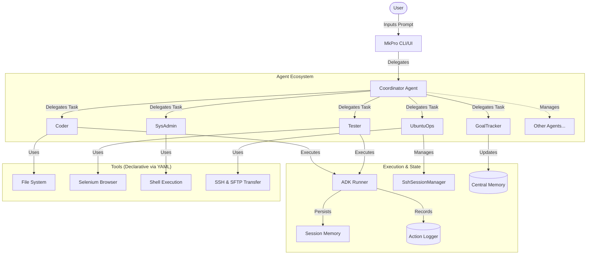

# mkpro - The AI Software Engineering Team

`mkpro` is an advanced, modular CLI assistant built on the Google Agent Development Kit (ADK). It orchestrates a team of **16 specialized AI agents** to autonomously handle complex software engineering tasks, from coding and testing to security audits, remote Linux infrastructure management, and cloud deployment. It supports a multi-provider backend, allowing you to mix and match local models (Ollama, Jlama) with powerful cloud models (Gemini, Bedrock, Azure, Sarvam).

## 🤖 Meet the Team

Your `mkpro` instance is not just a chatbot; it's a team of experts led by a Coordinator.

| Agent | Role & Capabilities |
| :--- | :--- |
| **Coordinator** | **Team Lead**. Orchestrates the workflow, manages long-term memory, and delegates tasks to the right specialist. It is your primary interface. |
| **GoalTracker** | **Project Manager**. Keeps track of ongoing session goals, creates TODO lists for complex tasks, and maintains progress in a local MapDB store. |
| **Coder** | **Software Engineer**. Reads and analyzes code. Leverages **Graph Memory** and **codebase search** to recall architectural patterns and context. |
| **CodeEditor** | **Code Manipulator**. Safely applies code changes to files with a built-in diff preview and user confirmation step. Automatically creates backups using `Maker.backItUp`. |
| **SysAdmin** | **System Operator**. Executes local shell commands, manages local infrastructure, and runs build tools (Maven, Gradle, npm). *Restricted from modifying code directly or managing git.* |
| **UbuntuOps** | **Persistent Remote Sandbox & SSH Specialist**. Manages persistent SSH sessions, executes remote commands, handles remote security policies, and transfers files via SFTP. |
| **GitAgent** | **Version Control Specialist**. Stages, commits, and pushes code. Enforces semantic commit messages and appends AI session token statistics to commit history. |
| **Tester** | **QA Engineer**. Writes unit and integration tests, runs test suites, performs browser-based E2E testing via Selenium. |
| **DocWriter** | **Technical Writer**. Maintains `README.md`, generates Javadocs/Docstrings, and ensures documentation stays in sync with code. |
| **SecurityAuditor** | **Security Analyst**. Scans code for vulnerabilities (SQLi, XSS, secrets), runs audit tools (`npm audit`), and recommends hardening steps. |
| **Architect** | **Principal Engineer**. Reviews high-level design, analyzes cohesion/coupling, enforces design patterns, plans refactoring, and uses **Graph Memory** to store and retrieve system designs. |
| **DatabaseAdmin** | **DBA**. Writes complex SQL queries, creates schema migration scripts, and analyzes database structures. |
| **DevOps** | **SRE / Cloud Engineer**. Writes Dockerfiles, Kubernetes manifests, CI/CD configs, and interacts with cloud CLIs (AWS, GCP). |
| **DataAnalyst** | **Data Scientist**. Analyzes data sets (CSV, JSON), writes Python scripts (pandas, numpy) for statistical analysis, and generates insights. |
| **AndroidDev** | **Mobile Engineer (Android)**. Expert in Kotlin, Jetpack Compose, Android SDK, and Gradle-based Android projects. |
| **IosDev** | **Mobile Engineer (iOS)**. Expert in Swift, SwiftUI, Xcode, and iOS frameworks. |

### Agent Interaction Flow


```mermaid
graph TD
    User([User]) -->|Inputs Prompt| MkPro[MkPro CLI/UI]
    MkPro -->|Delegates| Coordinator[Coordinator Agent]
    
    subgraph "Agent Ecosystem"
        Coordinator -->|Delegates Task| Coder[Coder]
        Coordinator -->|Delegates Task| Tester[Tester]
        Coordinator -->|Delegates Task| SysAdmin[SysAdmin]
        Coordinator -->|Delegates Task| UbuntuOps[UbuntuOps]
        Coordinator -->|Delegates Task| GoalTracker[GoalTracker]
        Coordinator -.->|Manages| Others[Other Agents...]
    end

    subgraph "Execution & State"
        Coder -->|Executes| Runner[ADK Runner]
        Tester -->|Executes| Runner
        UbuntuOps -->|Manages| SshMgr[SshSessionManager]
        Runner -->|Persists| Session[Session Memory]
        Runner -->|Records| ActionLogger[(Action Logger)]
        GoalTracker -->|Updates| CentralMem[(Central Memory)]
    end

    subgraph "Tools (Declarative via YAML)"
        Coder -->|Uses| FileTools[File System]
        Tester -->|Uses| Selenium[Selenium Browser]
        SysAdmin -->|Uses| Shell[Shell Execution]
        UbuntuOps -->|Uses| SshTools[SSH & SFTP Transfer]
    end
```

## 🏗️ Architecture

### Core Components

| Component | Responsibility |
| :--- | :--- |
| `BootstrapService` | Application initialization, service wiring, shutdown hooks |
| `AgentManager` | Creates LLM instances, builds runners, manages delegation tools |
| `ToolRegistry` | Maps declarative tool names (from YAML) to `BaseTool` instances |
| `AgentFactory` | Builds `LlmAgent` from `AgentDefinition` + resolved tools |
| `CentralMemory` | Persistent state store (hot/shared split architecture) |
| `MkProContext` | Application state container passed to commands and UI |
| `TerminalUI` | JLine-based interactive terminal loop |

### CentralMemory Architecture & Modernized Storage

CentralMemory uses a **hot/shared split** for multi-instance safety with a fully modernized, platform-aware storage layout:

- **Hot Store** (per-instance, always open): Agent statistics — high-frequency writes with zero contention between instances.
- **Shared Store** (brief file lock with retry): Agent configs, goals, memories, MCP servers — opened briefly for writes, reads served from in-memory cache.
- **Local Cache**: `ConcurrentHashMap` for configs, volatile lists for servers. Populated on startup, invalidated on writes, refreshable via `refreshCache()` when SyncEngine receives peer updates.
- **Platform-Aware Directory Standards**: Stores databases, configs, caches, and logs in OS-standard locations:
  - **Windows**: `%APPDATA%\mkpro` (roaming/shared data and configuration) and `%LOCALAPPDATA%\mkpro` (local cache/temp).
  - **Linux / macOS**: `$XDG_CONFIG_HOME/mkpro` (or `~/.config/mkpro`) and `$XDG_DATA_HOME/mkpro` (or `~/.local/share/mkpro`).
- **Zero Workspace Root Pollution**: All persistent databases, telemetry, and temporary files reside cleanly within the user's OS application directories, keeping repository workspaces untainted.

### Declarative Tool Assignment

Agent tools are defined in team YAML files rather than hardcoded:

```yaml
agents:
  - name: Coder
    tools: [file_read, clipboard, codebase_search, mcp_scan, graph_memory, fetch_url]
    
  - name: SysAdmin
    tools: [shell, file_read, file_write, safe_write, clipboard]

  - name: UbuntuOps
    tools: [ssh_exec, ssh_file_transfer, ssh_list_sessions, file_read, clipboard]
    
  - name: Tester
    tools: [file_read, file_write, safe_write, clipboard, shell, selenium]
```

Available tool names: `file_read`, `file_write`, `safe_write`, `clipboard`, `shell`, `image`, `codebase_search`, `multi_project_search`, `mcp_scan`, `graph_memory`, `fetch_url`, `stats`, `selenium`, `scripting`, `verify_fact`, `ssh_exec`, `ssh_file_transfer`, `ssh_list_sessions`, `screen_capture`.

## 🎓 Academic Research View & Modern UI

`mkpro` features a modern UI architecture with dual-view routing and publication-grade aesthetics:

- **Academic Research View (Default Route `/`)**: Serving `academic_view.html` at `http://localhost:8080/`, this default view provides a distraction-free, publication-styled workbench optimized for in-depth code reading, literature synthesis, and architectural research. Features minimalist editorial aesthetics with **EB Garamond** serif typography, on-demand slide-over file explorer (`Ctrl+B`), line-numbered manuscript inspector, multi-modal lightbox zoom (`Ctrl+V`), and 1-click response copying.
- **Classic View (`/classic`)**: Access the traditional dashboard and terminal-style layout via `http://localhost:8080/classic`.
- **Cross-Navigation Header Links**: Seamlessly toggle between Academic View, Classic View, Knowledge Dashboard (`/knowledge`), MapDB browser (`/db`), and Sandbox credentials.

## 👁️ Modular File Inspector & Media Viewers

The web interface includes an advanced, feature-rich file and artifact inspection suite:

- **Dual-Mode Tabbed Viewer**: Instantly switch between `[ 👁️ Rendered Preview ]` and `[ 📝 Source Code ]` for Markdown and HTML documents.
- **Integrated PDF.js Canvas Viewer**: Native client-side PDF rendering with page navigation, zoom controls, and text selection.
- **Lightbox Image Pan/Zoom & Binary Fallbacks**: High-resolution image inspection with interactive zoom/pan capabilities and informative fallback cards for binary or unsupported artifacts.

## 🖥️ Multi-Monitor Screen Capture (`/capture`)

Capture and analyze visual context directly from your desktop environments:
- **Multi-Monitor Screenshot Engine**: Automatically discovers and captures screenshots across all active displays, saving artifacts to `.mkpro/captures/`.
- **Interactive Chat Cards**: Rendered thumbnails in the chat stream with instant inspection.
- **Automatic File Inspector Popup**: Opens captured images directly in the Modular File Inspector for deep visual review by vision-capable models (e.g., Gemini).

## ⚡ Smart Event Filtering Plugin (`/compact`)

Powered by the Google ADK `SmartEventFilterPlugin`, `mkpro` maintains optimal context windows during long-running sessions:
- **Anchor Pinning**: Automatically preserves critical reference points including Turn 0 user goal, system instructions, and pinned memory events.
- **Tool Output Pruning & Churn Eviction**: Automatically prunes oversized tool outputs (> 2KB) and evicts stale tool churn.
- **Interactive Slash Commands**:
  - `/compact [turns]` — Compacts conversation history.
  - `/compact filter` — Displays event filtering statistics.
  - `/compact prune <chars>` — Adjusts tool output pruning threshold.
  - `/compact churn <on|off>` — Toggles stale tool churn eviction.

## 📦 Persistent Remote Sandbox & SSH Infrastructure (`UbuntuOps`)

`mkpro` features robust remote infrastructure management through the dedicated `UbuntuOps` specialist agent:
- **Persistent `SshSessionManager`**: Manages persistent SSH sessions with automatic keep-alive, session aliasing, and multiplexing.
- **Web UI `📦 Sandbox` Credentials Modal**: Secure credential configuration supporting Password authentication, SSH Key Files, and Inline Private Keys.
- **AES-GCM Encryption in MapDB**: All sensitive credentials are encrypted using AES-GCM and securely stored in CentralMemory MapDB.
- **Startup Auto-Reconnecting**: Automatically re-establishes persistent SSH sessions upon application startup.
- **High-Speed Bidirectional SFTP**: Transfer files seamlessly between local workspaces and remote sandboxes using `ssh_file_transfer` or `/ssh transfer`.
- **Remote Security Policies**: Enforced `RemoteCommandPolicy` and `RemotePathValidator` preventing dangerous operations (e.g., destructive deletions or root-level modifications) on remote systems.

## 🌐 REST API

When running with `--web`, mkpro exposes a full HTTP REST API alongside the WebSocket chat. No additional configuration needed.

### Endpoints

| Method | Endpoint | Description |
| :--- | :--- | :--- |
| `POST` | `/api/chat` | Synchronous chat — send message, get full response |
| `POST` | `/api/chat/stream` | Streaming chat via Server-Sent Events (SSE) |
| `POST` | `/api/command` | Execute CLI commands (`/know`, `/train`, `/status`, `/ssh`, etc.) |
| `GET` | `/api/status` | System info (version, runner, scheduler, Markov stats) |
| `GET` | `/api/agents` | List all agents with tools, model, and provider |
| `GET` | `/api/knowledge` | All knowledge topics as JSON |
| `GET` | `/api/knowledge/search?q=` | TF-IDF knowledge search |
| `POST` | `/api/knowledge/topics` | Add a new knowledge topic |
| `DELETE` | `/api/knowledge/topics?name=` | Remove a knowledge topic |
| `GET` | `/api/git/branch` | Current branch + all local/remote branches |
| `POST` | `/api/git/switch` | Switch git branch (with multi-user confirmation) |
| `GET` | `/api/files?path=` | List project directory contents |
| `GET` | `/api/file-content?path=` | Read file content (10KB cap) |
| `GET` | `/api/file-raw?path=` | Raw binary file with MIME type (20MB cap) |
| `GET` | `/api/history?offset=&limit=` | Paginated chat history |
| `POST` | `/api/edit/approve` | Approve pending file edit |
| `POST` | `/api/edit/reject` | Reject pending file edit |
| `GET` | `/api/edit/pending` | List pending edit proposals |
| `GET` | `/api/db` | MapDB store browser (all stores as JSON) |

### Usage Examples

```bash
# Ask a question (synchronous, blocks until complete)
curl -X POST http://localhost:8080/api/chat \
  -H "Content-Type: application/json" \
  -d '{"message": "explain the Markov router architecture"}'

# Stream response (Server-Sent Events)
curl -N -X POST http://localhost:8080/api/chat/stream \
  -H "Content-Type: application/json" \
  -d '{"message": "write unit tests for TopicIndex"}'

# Execute a CLI command
curl -X POST http://localhost:8080/api/command \
  -H "Content-Type: application/json" \
  -d '{"command": "/know status"}'

# Get system status
curl http://localhost:8080/api/status

# List all agents
curl http://localhost:8080/api/agents

# Search knowledge base
curl "http://localhost:8080/api/knowledge/search?q=kubernetes+security"

# Browse project files
curl "http://localhost:8080/api/files?path=src/main/java/com/mkpro"
```

### Response Format

**POST /api/chat**
```json
{
  "agent": "SecurityAuditor",
  "response": "Here's my analysis of the security...",
  "duration_ms": 3200
}
```

**POST /api/chat/stream** (SSE events)
```
data: {"type":"stream_start","agent":"Coder"}
data: {"type":"chunk","text":"Here's my analysis..."}
data: {"type":"chunk","text":" of the code."}
data: {"type":"stream_end"}
```

**POST /api/command**
```json
{"output": "Knowledge Scheduler Status\n  ✓ kubernetes-security → 2026-07-20T15:30\n..."}
```

On Windows:
```batch
mkpro-web.bat
mkpro-scheduler.bat
mkpro-headless.bat
mkpro-full.bat
```

On first launch, select your execution runner (InMemory, MapDB, or Postgres). Use `/config` to set your default provider and model.

## 📚 Additional Documentation

- **[Knowledge Scheduler](README_knowledge.md)** — Autonomous topic-based knowledge accumulation, TF-IDF search, topic discovery, confidence scoring, and the self-improving flywheel.
- **[Markov Chain Router](README_markov.md)** — Intent classification, transition probability matrix, learned patterns, stall prediction, and training pipeline.
- **[Fact Engine](README_fe.md)** — Verified math formulas, relationship graph, Groovy verification scripts, Knowledge→Fact pipeline, project fact discovery, and confidence scoring.

## 🤝 Contributing

We welcome contributions! Please feel free to submit Pull Requests or open issues for feature requests and bug reports.

## 📜 License

This project is licensed under the Apache License 2.0.
